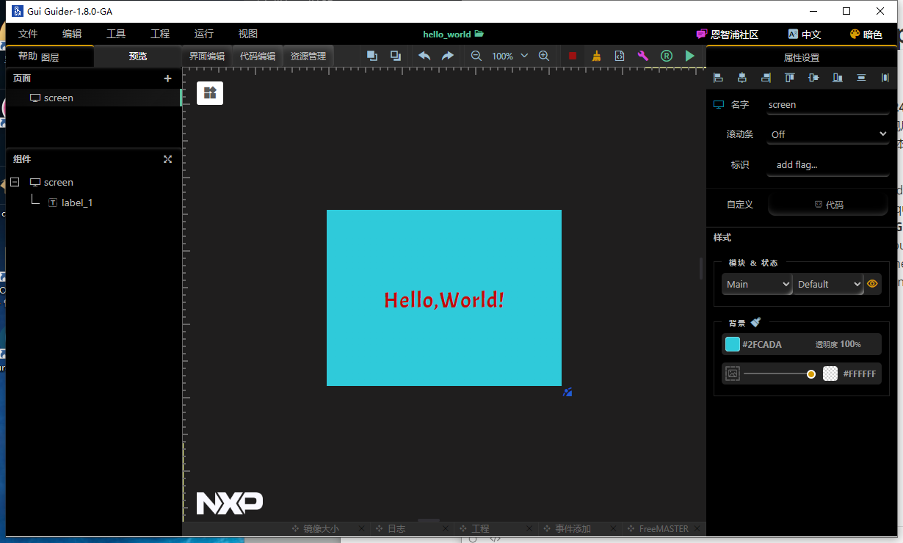
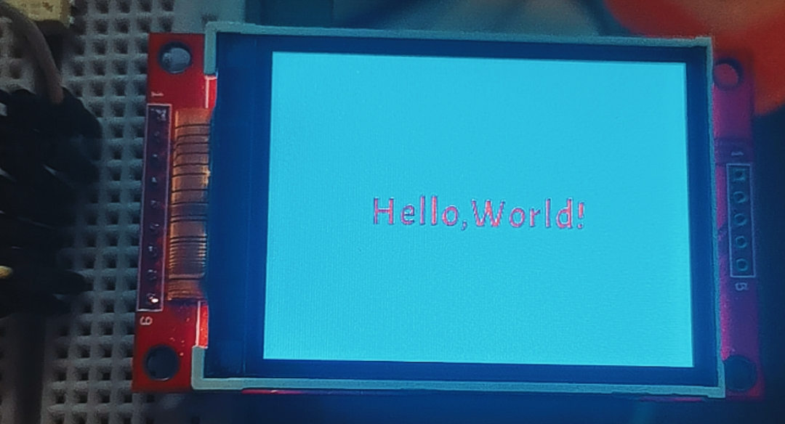
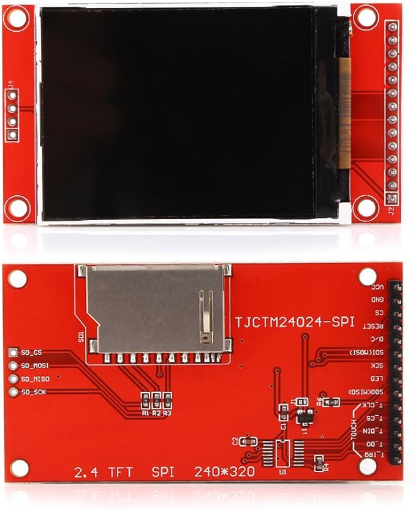

# pico_lvgl_ili9341_GUI_guider_display

### 概要(Abstract):

这是一个基于**lvgl version 8.3.10**版本的pico显示屏的项目，显示屏型号为**240*320**的**TFT SPI**显示屏，驱动芯片为**ili9341**控制器。通过添加**NXP**公司的**GUI_guider**自动生成的.c文件，实现屏幕上显示**hello_world**的字样。目前仅实现了测试中的显示功能，尚且未实现输入功能。其余功能可以参考本工程进行扩展。**GUI_guider**工程界面和实物效果图如下所示：

This is a **raspberry-pi-pico(RP2040)** project based on the project named **lvgl version 8.3.10**. The project needs a TFT SPI **screen** based on the **ili9341** as the output dispaly equipment. The screen's size is **240** pixels width and **320** pixels height. By adding the files produced by the **GUI_guider** software, which is developed by the **NXP** company, the project realizes the **"hello world"** output fuction. Only display function is realized.The touch function is not realized. If you want to go further, you can simply add more function based on this project. The image of the project in the **GUI_guider** and the image of the real products are as follows:





------

### 准备:

- **ili9341** **240*320 TFT SPI** 屏幕，有触摸功能和没有触摸功能都可以。
- **ubuntu** 我的版本是 **22.04.3** 我认为通过**Linux**平台均可以组建。
- **GUI-Guider version 1.8.0** 通过**NXP**公司的官网可以下载。
- **Raspberry-pi-pico** 

### paperation:

- **ili9341** **240*320 TFT SPI screen** It doesn't matter that it contains the funcion of touching.
- **ubuntu** The version I used is version **22.04.03**. I think it can be built by ant plantform of **Linux**.
- **GUI-Guider version 1.8.0** you can download it thourgh the website of **NXP**.
- **Raspberry-pi-pico** 



------

### 引脚连接(pin connection):

| Pin       | SPI         |
| --------- | ----------- |
| 6         | SCK/CLK     |
| 7         | MOSI/SDI/TX |
| 4         | MISO/SDO    |
| 13        | CS          |
| 14        | RST         |
| 15        | DC          |
| VCC(3.3V) | LED         |

------

### 组建：

#### 准备组建环境(prepare the environment of building):

假定你的系统已经安装好了**pico-sdk**的编译环境，理论上如果是windows，安装好了pico-sdk的组建环境也能够组建该工程。如果尚未配置好环境，请参阅树莓派官方的**getting-started-with-pico-C++**文章进行组建，下面是基于这篇文章的组建命令:

It assumes that you have already bulit the environment of building **pico-sdk**. I think if you have successfully built it on the plantform of windows, you can also buit this project. If not build, please read the article named **getting-started-with-pico-C++** relesed by the Raspberry Pi. The shell codes to build the environment of the pico-sdk are as follows:

1. ##### 获取pico-sdk和示例 Get the SDK and examples

   ```sh
   cd ~/
   mkdir pico
   cd pico
   git clone https://github.com/raspberrypi/pico-sdk.git --branch master
   cd pico-sdk
   git submodule update --init
   cd ..
   git clone https://github.com/raspberrypi/pico-examples.git --branch master
   ```

2. ##### 安装编译交叉链 Install the Toolchain

   ```sh
   sudo apt update
   sudo apt install cmake gcc-arm-none-eabi libnewlib-arm-none-eabi build-essential
   ```

3. ##### 更新SDK Updating the SDK

   ```sh
   cd pico-sdk
   git pull
   git submodule update
   ```

### 	克隆仓库(git clone):

```sh
git clone -b masterhttps://github.com/zengshuaixiong/pico_lvgl_ili9341_GUI_guider_display.git
```

或者(or):

```sh
git clone https://github.com/zengshuaixiong/pico_lvgl_ili9341_GUI_guider_display.git
```

fetch the git submodules:

```sh
cd pico_lvgl_ili9341_GUI_guider_display
git submodule init
git submodule update
```

### 	组建(building):

```sh
mkdir build
cd build
export PICO_SDK_PATH=../../pico-sdk
cmake ..
make
```

说明:pico-sdk的路径需要自己设置，上述命令建立在工程与pico-sdk在同一目录下。

Addition: The path of pico-sdk needs to be reset. If you want to use the shell code, you need to put the project's path into the direction near by the folder of pico-sdk.

------

### 最后(Conclusion):

你应该可以得到对应的.UF2文件，下载到pico里面。

Then you can get the file of UF2, download it into the pico.

------

### 特别鸣谢(Special Thanks):

特别感谢我参考的基于pico的ili9341的工程，在此基础上我成功完成了此项目。链接如下：[rprouse/ILI9341_PICO_DisplayExample：将 ILI9341 SPI TFT 显示器与 Raspberry Pi Pico 一起使用的示例代码](https://github.com/rprouse/ILI9341_PICO_DisplayExample)

Special thanks to the reference of PICO DisplayExample. I got success based on it. Here is the link:[rprouse/ILI9341_PICO_DisplayExample](https://github.com/rprouse/ILI9341_PICO_DisplayExample)

------

### 过程(process):

你同样可以根据以下步骤复刻我的修改过程：

You can also repeat my process of the project as follows:

1. 克隆特别鸣谢中的仓库 git clone the repositories of the link in the special thanks.

   ```sh
   git clone https://github.com/rprouse/ILI9341_PICO_DisplayExample.git
   cd ILI9341_PICO_DisplayExample
   git submodule init
   git submodule update
   ```

2. 在这个工程文件夹中克隆lvgl 8.3版本。git clone the lgvl release V8.3 in this file direction.

   ```sh
   git clone -b release/v8.3 https://github.com/lvgl/lvgl.git
   ```

3. 复制lvgl目录下的lv.conf.template.h到工程文件夹下，与lvgl并列一个目录。重命名为lv.conf,h,并修改宏定义为1进行使能。 Copy the lv.conf.template.h into the direction of the project, near by the file of lvgl. Rename the file as lv.conf.h, and enable it by defining 1 in the text.

   ```c
   /* clang-format off */
   #if 1 /* Set this to "1" to enable content */
   
   #ifndef LV_CONF_H
   #define LV_CONF_H
   
   /* If you need to include anything here, do it inside the `__ASSEMBLY__` guard */
   #if  0 && defined(__ASSEMBLY__)
   #include "my_include.h"
   #endif
   ```

4. 复制lvgl/examples/porting文件夹到工程内，我把它放在了lib文件夹里面，并且需要添加合适的CMakeList.txt。 Copy the Direction of lvgl/examples/porting into the project, I put them into the direction of the lib, and add CMakeList.txt.

5. 重命名其中的lv_port_disp_template.c和lv_port_disp_template.h为lv_port_disp.c和lv_port_disp.h。修改里面的相关函数以实现显示接口。请修改下述提到的函数代码。 Rename the file of lv_port_disp_template.c and lv_port_disp_template.h into lv_port_disp.c and lv_port_disp.h. Change the fuction to realize the display porting. Please change the code as following.

   ```c
   /*Copy this file as "lv_port_disp.c" and set this value to "1" to enable content*/
   #if 1
   
   /*********************
    *      INCLUDES
    *********************/
   #include <stdbool.h>
   #include "lv_port_disp.h"
   #include "ili9341.h"
   /*********************
   
   //.......
   
    /* Example for 1) */
       // static lv_disp_draw_buf_t draw_buf_dsc_1;
       // static lv_color_t buf_1[MY_DISP_HOR_RES * 10];                          /*A buffer for 10 rows*/
       // lv_disp_draw_buf_init(&draw_buf_dsc_1, buf_1, NULL, MY_DISP_HOR_RES * 10);   /*Initialize the display buffer*/
   
       /* Example for 2) */
       static lv_disp_draw_buf_t draw_buf_dsc_2;
       static lv_color_t buf_2_1[MY_DISP_HOR_RES * 10];                        /*A buffer for 10 rows*/
       static lv_color_t buf_2_2[MY_DISP_HOR_RES * 10];                        /*An other buffer for 10 rows*/
       lv_disp_draw_buf_init(&draw_buf_dsc_2, buf_2_1, buf_2_2, MY_DISP_HOR_RES * 10);   /*Initialize the display buffer*/
   
       /* Example for 3) also set disp_drv.full_refresh = 1 below*/
       // static lv_disp_draw_buf_t draw_buf_dsc_3;
       // static lv_color_t buf_3_1[MY_DISP_HOR_RES * MY_DISP_VER_RES];            /*A screen sized buffer*/
       // static lv_color_t buf_3_2[MY_DISP_HOR_RES * MY_DISP_VER_RES];            /*Another screen sized buffer*/
       // lv_disp_draw_buf_init(&draw_buf_dsc_3, buf_3_1, buf_3_2,
       //                       MY_DISP_VER_RES * LV_VER_RES_MAX);   /*Initialize the display buffer*/
   
    /*Set a display buffer*/
       disp_drv.draw_buf = &draw_buf_dsc_2;
   
   /*Flush the content of the internal buffer the specific area on the display
    *You can use DMA or any hardware acceleration to do this operation in the background but
    *'lv_disp_flush_ready()' has to be called when finished.*/
   static void disp_flush(lv_disp_drv_t * disp_drv, const lv_area_t * area, lv_color_t * color_p)
   {
       if(disp_flush_enabled) {
           /*The most simple case (but also the slowest) to put all pixels to the screen one-by-one*/
   
           int32_t x;
           int32_t y;
           uint16_t i=0;
           for(y = area->y1; y <= area->y2; y++) {
               for(x = area->x1; x <= area->x2; x++) {
                   /*Put a pixel to the display. For example:*/
                   uint16_t color_uint = (color_p[i].ch.red << 11) | (color_p[i].ch.green << 5) | color_p[i].ch.blue;
                   LCD_WritePixel(x,y,color_uint);
                   /*put_px(x, y, *px_map)*/
                   i++;
               }
           }
       }
   
       /*IMPORTANT!!!
        *Inform the graphics library that you are ready with the flushing*/
       lv_disp_flush_ready(disp_drv);
   }
   ```

   ```c
   /**
    * @file lv_port_disp_templ.h
    *
    */
   
   /*Copy this file as "lv_port_disp.h" and set this value to "1" to enable content*/
   #if 1
   
   #ifndef LV_PORT_DISP_H
   #define LV_PORT_DISP_H
   ```

   ```cmake
   add_library(porting
   	lv_port_disp.c
   )
   
   target_include_directories(porting PUBLIC
   	.
   )
   
   target_link_libraries(porting pico_stdlib hardware_spi hardware_dma lvgl ili9341)
   ```

6. 将GUI_guider生成的generated和custom文件夹里面所有的文件（包括.c和.h）文件放置在lib/out文件夹下,添加合适的CMakeList.txt。 Put the files generated by the sofeware named GUI_guider into the direction of lib/out. Add the CMakeList.txt.

   ```cmake
   add_library(out
   	custom.c
   	gui_guider.c
   	events_init.c
   	setup_scr_screen.c
   	widgets_init.c
   	lv_font_Acme_Regular_30.c
   	lv_font_montserratMedium_16.c
   )
   
   target_include_directories(out PUBLIC
   	.
   )
   
   target_link_libraries(out pico_stdlib hardware_spi hardware_dma lvgl)
   ```

7. 修改工程CMakeList.txt。 Change the project's CMakeList.txt.

   ```cmake
   add_subdirectory(lib/ili9341)
   add_subdirectory(lib/gfx)
   add_subdirectory(pico-extras)
   add_subdirectory(lvgl)
   add_subdirectory(lib/porting)
   add_subdirectory(lib/out)
   
   target_link_libraries(DisplayTest pico_stdlib hardware_adc) 
   # Add any user requested libraries
   target_link_libraries(DisplayTest
           ili9341
           gfx
           lvgl
           porting
           out
           )
           
   ```

8. 修改主函数DisplayTest.c。 Change the function of DisplayTest.c.

   ```c
   #include <stdio.h>
   #include <string.h>
   #include "pico/stdlib.h"
   #include "ili9341.h"
   #include "gfx.h"
   #include "DisplayTest.h"
   #include "lvgl/lvgl.h"
   #include "hardware/adc.h"
   
   #include "lvgl/examples/porting/lv_port_disp.h"
   #include "lib/out/gui_guider.h"
   #include "lib/out/events_init.h"
   lv_ui guider_ui; ////using the NXP GUI_guider's ui
   
   static void lv_ex_label(void) 
   {
   	static char* github_addr = "https://gitee.com/WRS0923";
   	lv_obj_t * label = lv_label_create(lv_scr_act());
       //lv_label_set_recolor(label, true);
       lv_label_set_long_mode(label, LV_LABEL_LONG_SCROLL_CIRCULAR); /*Circular scroll*/
       lv_obj_set_width(label, 120);
       lv_label_set_text_fmt(label, "#ff0000 Gitee: %s#", github_addr);
       lv_obj_align(label, LV_ALIGN_CENTER, 0, 10);
   	
       lv_obj_t * label2 = lv_label_create(lv_scr_act());
       //lv_label_set_recolor(label2, true);
       lv_label_set_long_mode(label2, LV_LABEL_LONG_SCROLL_CIRCULAR); /*Circular scroll*/
       lv_obj_set_width(label2, 120);
       lv_label_set_text_fmt(label2, "#ff0000 Hello# #0000ff world !123456789#");
       lv_obj_align(label2, LV_ALIGN_CENTER, 0, -10);
   }
   
   
   //test it is not depend on the direction of the lib/out
   //你可以只是运行这个函数来测试lvgl是否成功，因为这个函数不基于NXP的软件，需要将using the NXP GUI_guider's ui注释的三条语句注释掉就行了
   
   void lv_example_get_started_1(void) 
   {
       lv_obj_t * btn = lv_btn_create(lv_scr_act());     /*Add a button the current screen*/
       lv_obj_set_pos(btn, 10, 10);                            /*Set its position*/
       lv_obj_set_size(btn, 120, 50);                          /*Set its size*/
       //lv_obj_add_event_cb(btn, btn_event_cb, LV_EVENT_ALL, NULL);           /*Assign a callback to the button*/
       lv_obj_t * label = lv_label_create(btn);          /*Add a label to the button*/
       lv_label_set_text(label, "Button");                     /*Set the labels text*/
       lv_obj_center(label); 
   }
   
   static void lv_100ask_widget_test_init(void);
   
   static void lv_100ask_widget_test_init(void)
   {
      
   }
   
   #define COMMODORE64 1
   
   int main()
   {
       stdio_init_all();
       InitializeDisplay(0xFFFF);
       //LCD_setPins(TFT_DC, TFT_CS, TFT_RST, TFT_SCLK, TFT_MOSI);
       //LCD_initDisplay();
       //LCD_setRotation(TFT_ROTATION);
       lv_init();
       lv_port_disp_init();
       setup_ui(&guider_ui); //using the NXP GUI_guider's ui
       events_init(&guider_ui); //using the NXP GUI_guider's ui
       adc_init();
       // Make sure GPIO is high-impedance, no pullups etc
       adc_gpio_init(26);
       lv_100ask_widget_test_init();
       //lv_ex_label();
       //lv_example_get_started_1();
       while (true)
       {
           sleep_ms(5);   /*Sleep for 5 millisecond*/
           lv_task_handler();
           lv_tick_inc(5);      /*Tell LVGL that 5 milliseconds were elapsed*/
           //lv_example_get_started_1();
       }
       
   /*
   #ifdef COMMODORE64
       InitializeDisplay(FOREGROUND);
       Commodore64();
   #else
       InitializeDisplay(BACKGROUND);
       Terminal();
   #endif
   
   */
   
   
       return 0;
   }
   
   void printLine(uint16_t line, const char *str)
   {
       int len = strlen(str);
       GFX_setCursor(INDENT * 2, INDENT + line * LINE_HEIGHT);
       GFX_printf(str);
       GFX_flush();
   }
   
   void InitializeDisplay(uint16_t color)
   {
       // Initialize display
       puts("Initializing display...");
       LCD_setPins(TFT_DC, TFT_CS, TFT_RST, TFT_SCLK, TFT_MOSI);
       LCD_initDisplay();
       LCD_setRotation(TFT_ROTATION);
       GFX_createFramebuf();
       GFX_setClearColor(color);
       GFX_setTextBack(BACKGROUND);
       GFX_setTextColor(FOREGROUND);
       GFX_clearScreen();
   }
   
   // This displays a fake Commodore 64 screen
   void Commodore64()
   {
       // Initialize GFX
       puts("Initializing graphics...");
       GFX_fillRect(MARGIN * 2, MARGIN, GFX_getWidth() - MARGIN * 4, GFX_getHeight() - MARGIN * 2, BACKGROUND);
       GFX_flush();
   
       // Draw some text
       puts("Writing...");
       uint16_t line = 0;
       printLine(line++, "    **** COMMODORE 64 BASIC V2 ****");
       printLine(line++, " 64K RAM SYSTEM  38911 BASIC BYTES FREE");
       printLine(line++, "READY.");
       printLine(line++, "LOAD\"*\",8,1");
       printLine(line++, "SEARCHING FOR *");
       printLine(line++, "LOADING");
       printLine(line++, "READY.");
       printLine(line++, "RUN");
       printLine(line++, "HELLO WORLD");
   
       while (true)
       {
           puts("Ping...");
           GFX_fillRect(INDENT * 2, INDENT + line * LINE_HEIGHT, 6, 8, BACKGROUND);
           GFX_flush();
           sleep_ms(500);
   
           GFX_fillRect(INDENT * 2, INDENT + line * LINE_HEIGHT, 6, 8, FOREGROUND);
           GFX_flush();
           sleep_ms(500);
       }
   }
   
   // This displays a scrolling terminal
   void Terminal()
   {
       int currentLine = 0;
   
       int w = GFX_getWidth();
       int h = GFX_getHeight();
   
       GFX_printf("Screen size: %d x %d\n", w, h);
       currentLine++;
       GFX_flush();
   
       for (int i = 1; i < 32; i++)
       {
           currentLine++;
           if (currentLine * LINE_HEIGHT > h)
           {
               GFX_scrollUp(LINE_HEIGHT);
               GFX_setCursor(0, h - LINE_HEIGHT);
               currentLine--;
           }
           GFX_printf("Line %d\n", i);
           GFX_flush();
           sleep_ms(DELAY);
       }
   }
   ```

9. 组建。 Building.

------

### 替换NXP文件(Replace the files of the NXP_GUI_guider):

将Gui_guider工程导出的所有文件(包含custom和generated两个文件夹)合并到一个文件夹内，并添加合适的CMakeList.txt。 Put all files generated by the Gui_guider into a direction,add useful CMakeList.txt.

例如：如果你将main.c放置到了lib/out文件夹里面，则out文件夹中:

For example: if you put the main.c into the direction of lib/out direction, then in the direction named out:

```cmake
add_library(out
	main.c
)

target_include_directories(out PUBLIC
	.
)

target_link_libraries(out pico_stdlib hardware_spi hardware_dma lvgl)
```

主工程文件夹中：In the project files:

```cmake
add_subdirectory(lib/out)
target_link_libraries(DisplayTest out)
```

